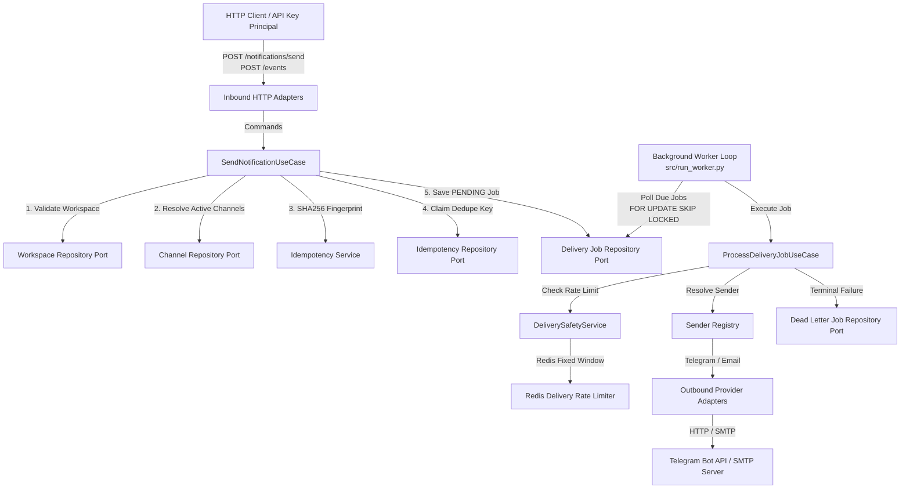

# AI Manifest - Notiq

This document provides a machine-readable, comprehensive architecture and codebase reference for **Notiq**, designed for LLMs and automated tools.

---

## 1. System Architecture & Data Flow

### 1.1 Architectural Pattern
Notiq is designed as a **Modular Monolith** applying **Hexagonal Architecture (Ports and Adapters)**. The application decouples domain logic, application orchestration, transport controllers, and external infrastructure.



### 1.2 Inbound Intake Data Flow
1. **Client Request**: Clients issue `POST /notifications/send` (or legacy `POST /events`) with a workspace ID, event identifier, event name, payload, and optional target channel filter.
2. **Authentication & Validation**: `require_auth` dependency verifies the `Authorization: Bearer <api_key>` header against hashed keys in PostgreSQL.
3. **Workspace Check**: `SendNotificationUseCase` verifies that the target workspace exists and `is_active == True`.
4. **Channel Resolution**: Active delivery channels configured for the workspace are loaded. If explicit `channel_ids` were provided in the request, active channels are filtered to that subset.
5. **Deduplication & Fingerprinting**:
   - Event fingerprint: `SHA256(workspace_id:event_id:event_name:canonical_payload_json)`
   - Channel fingerprint: `SHA256(event_fingerprint:channel_id)`
   - The channel fingerprint is claimed in `idempotency_keys` table. Duplicate submissions within the idempotency TTL are safely skipped.
6. **Job Enqueue**: A `DeliveryJob` entity with `status="PENDING"` is saved into the PostgreSQL database (`delivery_jobs` table) for each targeted channel.

### 1.3 Asynchronous Worker Delivery Pipeline
1. **Polling & Locking**: `NotificationWorker` (launched via `src/run_worker.py`) periodically queries `delivery_jobs` where `status IN ('PENDING', 'PROCESSING')` and `next_retry_at <= NOW()`. It uses PostgreSQL `FOR UPDATE SKIP LOCKED` to safely claim batches of due jobs without worker contention.
2. **Safety & Rate Limiting**: `ProcessDeliveryJobUseCase` calls `DeliverySafetyService`, which enforces tenant and channel rate limit counters stored in Redis (`INCR` with fixed-window `EXPIRE`). If rate limits are exceeded, job execution is deferred with a configurable backoff window.
3. **Provider Resolution & Dispatch**:
   - `ProviderAccountResolver` fetches active credentials (`provider_accounts`).
   - `SenderRegistry` maps `provider_key` (`telegram`, `email`) to the corresponding `NotificationSenderPort` adapter implementation.
   - The adapter executes the network call (`TelegramNotifier` via `httpx` or `EmailNotifier` via `aiosmtplib`).
4. **Lifecycle & Retry Policies**:
   - **Success**: Status transitions to `SUCCESS`. Metric `notifications_success_total` increments.
   - **Transient Error** (HTTP 429, HTTP >= 500, timeouts, connection errors): If `retry_count < max_retries`, job status remains `PENDING` with exponential backoff: `next_retry_at = NOW() + 2^(retry_count + 1) seconds`.
   - **Terminal Error** (HTTP 4xx non-429, payload errors, or max retries exhausted): Job transitions to `FAILED`. A corresponding record is written to `dead_letter_jobs` for auditing and manual replay.

---

## 2. Core Modules & File Paths

### 2.1 Runtime Entry Points
- `src/main.py`: [main.py](file:///home/aswin/code/unifiedbits/notiq/src/main.py) - FastAPI application instance creation (`app = ApplicationFactory().create()`).
- `src/run.py`: [run.py](file:///home/aswin/code/unifiedbits/notiq/src/run.py) - Uvicorn HTTP server execution script (`python -m src.run`).
- `src/run_worker.py`: [run_worker.py](file:///home/aswin/code/unifiedbits/notiq/src/run_worker.py) - Asynchronous background notification polling worker process (`python -m src.run_worker`).
- `src/worker_main.py`: [worker_main.py](file:///home/aswin/code/unifiedbits/notiq/src/worker_main.py) - Deprecated legacy worker entry point (raises `RuntimeError`).

### 2.2 Application Bootstrap & Configuration
- `src/bootstrap/app.py`: [app.py](file:///home/aswin/code/unifiedbits/notiq/src/bootstrap/app.py) - `ApplicationFactory` initializing FastAPI routers and middleware.
- `src/bootstrap/container.py`: [container.py](file:///home/aswin/code/unifiedbits/notiq/src/bootstrap/container.py) - Dependency injection composition root (`ContainerFactory`, `Container`) wiring all use cases, repositories, and adapters.
- `src/bootstrap/settings.py`: [settings.py](file:///home/aswin/code/unifiedbits/notiq/src/bootstrap/settings.py) - Centralized application settings loaded via Pydantic `BaseSettings` (`Settings`).
- `src/bootstrap/workers/notification_worker.py`: [notification_worker.py](file:///home/aswin/code/unifiedbits/notiq/src/bootstrap/workers/notification_worker.py) - Polling worker loop (`NotificationWorker`) orchestrating batch job claims and use-case dispatch.

### 2.3 Modular Notifications Domain (`src/modules/notifications/domain`)
- **Entities**:
  - `src/modules/notifications/domain/entities/workspace.py`: [workspace.py](file:///home/aswin/code/unifiedbits/notiq/src/modules/notifications/domain/entities/workspace.py) - Multi-tenant workspace aggregate (`Workspace`).
  - `src/modules/notifications/domain/entities/channel.py`: [channel.py](file:///home/aswin/code/unifiedbits/notiq/src/modules/notifications/domain/entities/channel.py) - Delivery channel definition (`Channel`).
  - `src/modules/notifications/domain/entities/provider_account.py`: [provider_account.py](file:///home/aswin/code/unifiedbits/notiq/src/modules/notifications/domain/entities/provider_account.py) - Provider account & credentials configuration (`ProviderAccount`).
  - `src/modules/notifications/domain/entities/event.py`: [event.py](file:///home/aswin/code/unifiedbits/notiq/src/modules/notifications/domain/entities/event.py) - Inbound notification event (`Event`).
  - `src/modules/notifications/domain/entities/delivery_job.py`: [delivery_job.py](file:///home/aswin/code/unifiedbits/notiq/src/modules/notifications/domain/entities/delivery_job.py) - Asynchronous job lifecycle model (`DeliveryJob`, `DeliveryJobStatus`).
  - `src/modules/notifications/domain/entities/dead_letter_job.py`: [dead_letter_job.py](file:///home/aswin/code/unifiedbits/notiq/src/modules/notifications/domain/entities/dead_letter_job.py) - Permanently failed job model (`DeadLetterJob`).
- **Value Objects**:
  - `src/modules/notifications/domain/value_objects/event_fingerprint.py`: [event_fingerprint.py](file:///home/aswin/code/unifiedbits/notiq/src/modules/notifications/domain/value_objects/event_fingerprint.py) - SHA256 idempotency fingerprint types (`EventFingerprint`, `ChannelFingerprint`).
  - `src/modules/notifications/domain/value_objects/provider_key.py`: [provider_key.py](file:///home/aswin/code/unifiedbits/notiq/src/modules/notifications/domain/value_objects/provider_key.py) - Validated provider type (`ProviderKey`).
- **Domain Services**:
  - `src/modules/notifications/domain/services/idempotency_service.py`: [idempotency_service.py](file:///home/aswin/code/unifiedbits/notiq/src/modules/notifications/domain/services/idempotency_service.py) - Deterministic SHA256 digest computation (`IdempotencyService`).
  - `src/modules/notifications/domain/services/rate_limit_service.py`: [rate_limit_service.py](file:///home/aswin/code/unifiedbits/notiq/src/modules/notifications/domain/services/rate_limit_service.py) - Rate limiting policy checking (`RateLimitService`).

### 2.4 Modular Notifications Application Layer (`src/modules/notifications/application`)
- **Use Cases**:
  - `send_notification_use_case.py`: [send_notification_use_case.py](file:///home/aswin/code/unifiedbits/notiq/src/modules/notifications/application/use_cases/send_notification_use_case.py) - Intake & enqueue use case (`SendNotificationUseCase`).
  - `process_delivery_job_use_case.py`: [process_delivery_job_use_case.py](file:///home/aswin/code/unifiedbits/notiq/src/modules/notifications/application/use_cases/process_delivery_job_use_case.py) - Worker execution, safety, retry & DLQ use case (`ProcessDeliveryJobUseCase`).
  - `create_managed_channel_use_case.py`: [create_managed_channel_use_case.py](file:///home/aswin/code/unifiedbits/notiq/src/modules/notifications/application/use_cases/create_managed_channel_use_case.py) - Channel creation (`CreateManagedChannelUseCase`).
  - `disable_managed_channel_use_case.py`: [disable_managed_channel_use_case.py](file:///home/aswin/code/unifiedbits/notiq/src/modules/notifications/application/use_cases/disable_managed_channel_use_case.py) - Channel deactivation (`DisableManagedChannelUseCase`).
  - `list_managed_channels_use_case.py`: [list_managed_channels_use_case.py](file:///home/aswin/code/unifiedbits/notiq/src/modules/notifications/application/use_cases/list_managed_channels_use_case.py) - Channel querying (`ListManagedChannelsUseCase`).
  - `create_provider_account_use_case.py`: [create_provider_account_use_case.py](file:///home/aswin/code/unifiedbits/notiq/src/modules/notifications/application/use_cases/create_provider_account_use_case.py) - Provider account setup (`CreateProviderAccountUseCase`).
  - `get_provider_account_use_case.py`: [get_provider_account_use_case.py](file:///home/aswin/code/unifiedbits/notiq/src/modules/notifications/application/use_cases/get_provider_account_use_case.py) - Provider account retrieval (`GetProviderAccountUseCase`).
  - `list_provider_accounts_use_case.py`: [list_provider_accounts_use_case.py](file:///home/aswin/code/unifiedbits/notiq/src/modules/notifications/application/use_cases/list_provider_accounts_use_case.py) - Provider account querying (`ListProviderAccountsUseCase`).
  - `get_dead_letter_job_use_case.py`: [get_dead_letter_job_use_case.py](file:///home/aswin/code/unifiedbits/notiq/src/modules/notifications/application/use_cases/get_dead_letter_job_use_case.py) - DLQ inspection (`GetDeadLetterJobUseCase`).
  - `list_dead_letter_jobs_use_case.py`: [list_dead_letter_jobs_use_case.py](file:///home/aswin/code/unifiedbits/notiq/src/modules/notifications/application/use_cases/list_dead_letter_jobs_use_case.py) - DLQ paginated listing (`ListDeadLetterJobsUseCase`).
  - `replay_dead_letter_job_use_case.py`: [replay_dead_letter_job_use_case.py](file:///home/aswin/code/unifiedbits/notiq/src/modules/notifications/application/use_cases/replay_dead_letter_job_use_case.py) - Re-enqueuing dead letter jobs (`ReplayDeadLetterJobUseCase`).
- **Services & Helpers**:
  - `delivery_safety_service.py`: [delivery_safety_service.py](file:///home/aswin/code/unifiedbits/notiq/src/modules/notifications/application/services/delivery_safety_service.py) - Rate limit evaluation (`DeliverySafetyService`).
  - `provider_account_resolver.py`: [provider_account_resolver.py](file:///home/aswin/code/unifiedbits/notiq/src/modules/notifications/application/services/provider_account_resolver.py) - Credential binding (`ProviderAccountResolver`).
  - `provider_configuration_validator.py`: [provider_configuration_validator.py](file:///home/aswin/code/unifiedbits/notiq/src/modules/notifications/application/services/provider_configuration_validator.py) - Credential structure validation (`ProviderConfigurationValidator`).
  - `sender_registry.py`: [sender_registry.py](file:///home/aswin/code/unifiedbits/notiq/src/modules/notifications/application/services/sender_registry.py) - Provider sender lookup (`SenderRegistry`).
  - `event_message_mapper.py`: [event_message_mapper.py](file:///home/aswin/code/unifiedbits/notiq/src/modules/notifications/application/mappers/event_message_mapper.py) - Event-to-message formatting (`EventMessageMapper`).

### 2.5 Ports & Interfaces
- Modular Notification Ports (`src/modules/notifications/ports/`):
  - `channel_repository_port.py`, `dead_letter_job_repository_port.py`, `delivery_job_repository_port.py`, `idempotency_repository_port.py`, `id_generator_port.py`, `notification_sender_port.py`, `provider_account_repository_port.py`, `sender_registry_port.py`, `workspace_repository_port.py`.
- Legacy / Admin Ports (`src/ports/`):
  - `admin_repository.py`, `api_key_repository.py`, `audit_log_repository.py`, `permission_repository.py`, `rate_limit_config_repository.py`, `role_repository.py`, `workspace_repository.py`.

### 2.6 Outbound Provider Adapters (`src/modules/notifications/adapters/outbound`)
- `telegram_notifier.py`: [telegram_notifier.py](file:///home/aswin/code/unifiedbits/notiq/src/modules/notifications/adapters/outbound/telegram/telegram_notifier.py) - Telegram Bot API integration using `httpx`.
- `email_notifier.py`: [email_notifier.py](file:///home/aswin/code/unifiedbits/notiq/src/modules/notifications/adapters/outbound/email/email_notifier.py) - Email delivery integration using `aiosmtplib`.

### 2.7 Inbound HTTP Transport Controllers (`src/adapters/http` & `src/modules/notifications/adapters/inbound/http`)
- `routes.py`: [routes.py](file:///home/aswin/code/unifiedbits/notiq/src/modules/notifications/adapters/inbound/http/routes.py) - `POST /notifications/send` router.
- `events_router.py`: [events_router.py](file:///home/aswin/code/unifiedbits/notiq/src/adapters/http/events_router.py) - Legacy `POST /events` adapter.
- `workspace_controller.py`: [workspace_controller.py](file:///home/aswin/code/unifiedbits/notiq/src/adapters/http/workspace_controller.py) - Workspace CRUD routes.
- `channel_controller.py`: [channel_controller.py](file:///home/aswin/code/unifiedbits/notiq/src/adapters/http/channel_controller.py) - Channel management routes.
- `provider_account_controller.py`: [provider_account_controller.py](file:///home/aswin/code/unifiedbits/notiq/src/adapters/http/provider_account_controller.py) - Provider account management routes.
- `dead_letter_controller.py`: [dead_letter_controller.py](file:///home/aswin/code/unifiedbits/notiq/src/adapters/http/dead_letter_controller.py) - Dead letter queue routes & replay.
- `api_key_controller.py`: [api_key_controller.py](file:///home/aswin/code/unifiedbits/notiq/src/adapters/http/controllers/api_key_controller.py) - Workspace API key management routes.
- `admin_controller.py`: [admin_controller.py](file:///home/aswin/code/unifiedbits/notiq/src/adapters/http/admin_controller.py) - Admin RBAC & rate limit routes.
- `admin_audit_controller.py`: [admin_audit_controller.py](file:///home/aswin/code/unifiedbits/notiq/src/adapters/http/admin_audit_controller.py) - Audit log querying routes.
- `metrics_controller.py`: [metrics_controller.py](file:///home/aswin/code/unifiedbits/notiq/src/adapters/http/metrics_controller.py) - Snapshot metrics route (`GET /metrics`).

### 2.8 Persistence & Infrastructure (`src/infrastructure`)
- **PostgreSQL Notification Persistence**:
  - `src/infrastructure/persistence/postgres/models.py`: [models.py](file:///home/aswin/code/unifiedbits/notiq/src/infrastructure/persistence/postgres/models.py) - SQLAlchemy declarative models for delivery jobs, dead-letter jobs, provider accounts, channels, workspaces, and idempotency keys.
  - `delivery_job_repository.py`: [delivery_job_repository.py](file:///home/aswin/code/unifiedbits/notiq/src/infrastructure/persistence/postgres/delivery_job_repository.py) - `FOR UPDATE SKIP LOCKED` worker batch claiming.
  - `dead_letter_job_repository.py`: [dead_letter_job_repository.py](file:///home/aswin/code/unifiedbits/notiq/src/infrastructure/persistence/postgres/dead_letter_job_repository.py) - DLQ persistence.
  - `idempotency_repository.py`: [idempotency_repository.py](file:///home/aswin/code/unifiedbits/notiq/src/infrastructure/persistence/postgres/idempotency_repository.py) - Atomic key claim.
  - `channel_repository.py`, `provider_account_repository.py`, `workspace_repository.py`.
- **PostgreSQL Admin & Management Repositories**:
  - `src/infrastructure/database/models.py`: [models.py](file:///home/aswin/code/unifiedbits/notiq/src/infrastructure/database/models.py) - SQLAlchemy models for Admins, Roles, Permissions, API Keys, Audit Logs, Rate Limit Configs, Event Logs.
  - `postgres_admin_repository.py`, `postgres_api_key_repository.py`, `postgres_audit_log_repository.py`, `postgres_channel_repository.py`, `postgres_permission_repository.py`, `postgres_rate_limit_config_repository.py`, `postgres_role_repository.py`, `postgres_workspace_repository.py`.
- **Redis Rate Limiting**:
  - `src/infrastructure/redis/redis_delivery_rate_limiter.py`: [redis_delivery_rate_limiter.py](file:///home/aswin/code/unifiedbits/notiq/src/infrastructure/redis/redis_delivery_rate_limiter.py) - Fixed-window counter using Redis `INCR` + `EXPIRE`.
- **ID Generator**:
  - `src/infrastructure/id_generator/uuid_id_generator.py`: [uuid_id_generator.py](file:///home/aswin/code/unifiedbits/notiq/src/infrastructure/id_generator/uuid_id_generator.py) - UUIDv4 string generator (`UUIDIdGenerator`).

### 2.9 Shared & Observability (`src/shared`)
- `src/shared/observability/metrics_service.py`: [metrics_service.py](file:///home/aswin/code/unifiedbits/notiq/src/shared/observability/metrics_service.py) - In-memory and Redis metrics counters/gauges (`MetricsService`).
- `src/shared/observability/structured_logging.py`: [structured_logging.py](file:///home/aswin/code/unifiedbits/notiq/src/shared/observability/structured_logging.py) - JSON/structured event logging helper (`log_event`, `log_exception`).

---

## 3. Database Schemas, Models & State Structures

### 3.1 PostgreSQL Database Relational Schema

```sql
-- Workspaces Table
CREATE TABLE workspaces (
    workspace_id VARCHAR(64) PRIMARY KEY,
    name VARCHAR(255) NOT NULL,
    is_active BOOLEAN NOT NULL DEFAULT true,
    created_at TIMESTAMPTZ NOT NULL,
    updated_at TIMESTAMPTZ NOT NULL
);

-- Provider Accounts Table
CREATE TABLE provider_accounts (
    provider_account_id VARCHAR(64) PRIMARY KEY,
    workspace_id VARCHAR(64) REFERENCES workspaces(workspace_id) ON DELETE SET NULL,
    provider_key VARCHAR(64) NOT NULL,
    credentials JSONB NOT NULL DEFAULT '{}'::jsonb,
    is_default BOOLEAN NOT NULL DEFAULT false,
    is_active BOOLEAN NOT NULL DEFAULT true,
    created_at TIMESTAMPTZ NOT NULL,
    updated_at TIMESTAMPTZ NOT NULL,
    CONSTRAINT uq_provider_account_workspace_provider_account UNIQUE (workspace_id, provider_key, provider_account_id)
);
CREATE INDEX ix_provider_accounts_provider_key_active ON provider_accounts(provider_key, is_active);

-- Channels Table
CREATE TABLE channels (
    channel_id VARCHAR(64) PRIMARY KEY,
    workspace_id VARCHAR(64) NOT NULL REFERENCES workspaces(workspace_id) ON DELETE CASCADE,
    provider_key VARCHAR(64) NOT NULL,
    destination VARCHAR(255) NOT NULL,
    provider_account_id VARCHAR(64) REFERENCES provider_accounts(provider_account_id) ON DELETE SET NULL,
    is_active BOOLEAN NOT NULL DEFAULT true,
    metadata JSONB NOT NULL DEFAULT '{}'::jsonb,
    created_at TIMESTAMPTZ NOT NULL,
    updated_at TIMESTAMPTZ NOT NULL
);
CREATE INDEX ix_channels_workspace_active ON channels(workspace_id, is_active);
CREATE INDEX ix_channels_provider_account ON channels(provider_account_id);

-- Delivery Jobs Table
CREATE TABLE delivery_jobs (
    job_id VARCHAR(64) PRIMARY KEY,
    workspace_id VARCHAR(64) NOT NULL REFERENCES workspaces(workspace_id) ON DELETE CASCADE,
    channel_id VARCHAR(64) NOT NULL REFERENCES channels(channel_id) ON DELETE CASCADE,
    provider_key VARCHAR(64) NOT NULL,
    provider_account_id VARCHAR(64) REFERENCES provider_accounts(provider_account_id) ON DELETE SET NULL,
    destination VARCHAR(255) NOT NULL,
    message TEXT NOT NULL,
    event_payload JSONB NOT NULL DEFAULT '{}'::jsonb,
    dedupe_key VARCHAR(128) NOT NULL UNIQUE,
    status VARCHAR(16) NOT NULL DEFAULT 'PENDING',
    retry_count INT NOT NULL DEFAULT 0,
    max_retries INT NOT NULL DEFAULT 3,
    next_retry_at TIMESTAMPTZ NULL,
    processing_owner VARCHAR(128) NULL,
    processing_expires_at TIMESTAMPTZ NULL,
    last_error TEXT NULL,
    created_at TIMESTAMPTZ NOT NULL,
    updated_at TIMESTAMPTZ NOT NULL
);
CREATE INDEX ix_delivery_jobs_status_retry ON delivery_jobs(status, next_retry_at);
CREATE INDEX ix_delivery_jobs_processing_expires ON delivery_jobs(processing_expires_at);
CREATE INDEX ix_delivery_jobs_workspace_status ON delivery_jobs(workspace_id, status);

-- Dead Letter Jobs Table
CREATE TABLE dead_letter_jobs (
    id VARCHAR(64) PRIMARY KEY,
    original_job_id VARCHAR(64) NOT NULL UNIQUE REFERENCES delivery_jobs(job_id) ON DELETE CASCADE,
    workspace_id VARCHAR(64) NOT NULL REFERENCES workspaces(workspace_id) ON DELETE CASCADE,
    channel_id VARCHAR(64) NOT NULL REFERENCES channels(channel_id) ON DELETE CASCADE,
    provider VARCHAR(64) NOT NULL,
    payload JSONB NOT NULL DEFAULT '{}'::jsonb,
    failure_reason TEXT NOT NULL,
    failure_count INT NOT NULL DEFAULT 1,
    last_attempt_at TIMESTAMPTZ NOT NULL,
    created_at TIMESTAMPTZ NOT NULL
);
CREATE INDEX ix_dead_letter_jobs_workspace_created ON dead_letter_jobs(workspace_id, created_at);
CREATE INDEX ix_dead_letter_jobs_workspace_channel ON dead_letter_jobs(workspace_id, channel_id);

-- Idempotency Keys Table
CREATE TABLE idempotency_keys (
    dedupe_key VARCHAR(128) PRIMARY KEY,
    created_at TIMESTAMPTZ NOT NULL
);

-- API Keys Table
CREATE TABLE api_keys (
    id VARCHAR(64) PRIMARY KEY,
    workspace_id VARCHAR(64) NOT NULL REFERENCES workspaces(workspace_id) ON DELETE CASCADE,
    key_hash VARCHAR(64) NOT NULL UNIQUE,
    name VARCHAR(128) NOT NULL,
    is_active BOOLEAN NOT NULL DEFAULT true,
    created_at TIMESTAMPTZ NOT NULL
);
CREATE INDEX ix_api_keys_workspace_id ON api_keys(workspace_id);

-- Rate Limit Configs Table
CREATE TABLE rate_limit_configs (
    id VARCHAR(64) PRIMARY KEY,
    workspace_id VARCHAR(64) NULL REFERENCES workspaces(workspace_id) ON DELETE CASCADE,
    scope VARCHAR(16) NOT NULL, -- tenant, channel, provider, group, global
    key VARCHAR(128) NOT NULL,
    limit INT NOT NULL,
    window_seconds INT NOT NULL
);
CREATE INDEX ix_rate_limit_configs_workspace_scope ON rate_limit_configs(workspace_id, scope);
CREATE INDEX ix_rate_limit_configs_scope_key ON rate_limit_configs(scope, key);

-- Admin RBAC Tables
CREATE TABLE admins (
    id VARCHAR(64) PRIMARY KEY,
    name VARCHAR(255) NOT NULL,
    email VARCHAR(255) NOT NULL UNIQUE,
    password_hash VARCHAR(255) NOT NULL,
    is_active BOOLEAN NOT NULL DEFAULT true,
    created_at TIMESTAMPTZ NOT NULL
);

CREATE TABLE roles (
    id VARCHAR(64) PRIMARY KEY,
    name VARCHAR(128) NOT NULL UNIQUE,
    created_at TIMESTAMPTZ NOT NULL
);

CREATE TABLE permissions (
    id VARCHAR(64) PRIMARY KEY,
    name VARCHAR(128) NOT NULL UNIQUE,
    created_at TIMESTAMPTZ NOT NULL
);

CREATE TABLE role_permissions (
    role_id VARCHAR(64) REFERENCES roles(id) ON DELETE CASCADE,
    permission_id VARCHAR(64) REFERENCES permissions(id) ON DELETE CASCADE,
    PRIMARY KEY (role_id, permission_id)
);

CREATE TABLE admin_roles (
    admin_id VARCHAR(64) REFERENCES admins(id) ON DELETE CASCADE,
    role_id VARCHAR(64) REFERENCES roles(id) ON DELETE CASCADE,
    PRIMARY KEY (admin_id, role_id)
);

-- Immutable Audit Logs Table
CREATE TABLE audit_logs (
    id VARCHAR(64) PRIMARY KEY,
    actor_id VARCHAR(64) NULL,
    action VARCHAR(128) NOT NULL,
    resource VARCHAR(128) NOT NULL,
    resource_id VARCHAR(128) NOT NULL,
    before JSONB NULL,
    after JSONB NULL,
    metadata JSONB NULL,
    created_at TIMESTAMPTZ NOT NULL
);
-- Trigger prevents UPDATE or DELETE on audit_logs
```

### 3.2 Key Domain Enums & State Machines
- **DeliveryJobStatus**:
  - `PENDING`: Initial state when enqueued or scheduled for retry/deferral.
  - `PROCESSING`: Claimed by a worker via lease (`processing_owner`, `processing_expires_at`).
  - `SUCCESS`: Terminal success state.
  - `FAILED`: Terminal failure state.

---

## 4. API Endpoints & Integration Points

### 4.1 Ingestion Endpoints
- `POST /notifications/send`: Primary notification submission endpoint.
  - Headers: `Authorization: Bearer <api_key>` (optional in public router, required via auth dependency when enforced).
  - Request Body:
    ```json
    {
      "workspace_id": "ws-123",
      "event_id": "evt-456",
      "event_name": "order.created",
      "payload": { "order_id": "1001", "amount": 49.99 },
      "channel_ids": ["ch-789"]
    }
    ```
  - Response: `200 OK`
    ```json
    {
      "enqueued_jobs": 1,
      "skipped_duplicates": 0
    }
    ```
- `POST /events`: Legacy compatibility fan-out endpoint.
  - Headers: `Authorization: Bearer <api_key>`
  - Request Body: `{"event_type": "user.created", "payload": {}}`
  - Response: `200 OK` `{"status": "accepted"}`

### 4.2 Workspace Management Endpoints
- `POST /workspaces`: Create a workspace (`{"name": "Acme Corp"}`). Returns `201 Created`.
- `GET /workspaces`: List all workspaces.
- `GET /workspaces/{workspace_id}`: Fetch workspace details.

### 4.3 Channel & Provider Account Endpoints
- `POST /provider-accounts`: Register provider credentials (`workspace_id`, `provider`, `credentials`). Returns `201 Created`.
- `GET /provider-accounts?workspace_id={id}`: List provider accounts for workspace.
- `GET /provider-accounts/{provider_account_id}`: Get provider account metadata (credentials excluded).
- `POST /channels`: Create a delivery channel (`workspace_id`, `provider`, `provider_account_id`, `destination`, `metadata`). Returns `201 Created`.
- `GET /channels?workspace_id={id}`: List channels for workspace.
- `PATCH /channels/{channel_id}`: Disable a channel.

### 4.4 API Key Management Endpoints
- `POST /workspaces/{workspace_id}/api-keys`: Create an API key (`{"name": "Production Server"}`). Returns one-time unhashed key.
- `GET /workspaces/{workspace_id}/api-keys`: List masked API keys for workspace.
- `PATCH /api-keys/{api_key_id}/disable`: Disable an API key.

### 4.5 Dead-Letter Queue (DLQ) Endpoints
- `GET /dead-letters?workspace_id={id}&limit=100&offset=0`: List dead-lettered jobs.
- `GET /dead-letters/{dead_letter_job_id}`: Get dead-letter job details.
- `POST /dead-letters/{dead_letter_job_id}/replay`: Re-enqueue dead-lettered job into `delivery_jobs` queue.

### 4.6 Admin & RBAC Endpoints
- `POST /admin/auth/login`: Admin sign-in (`email`, `password`). Returns JWT access token.
- `GET /admin/me`: Get current admin profile, assigned roles, and permissions.
- `POST /admin/admins`: Create an admin user (Requires permission: `manage_admins`).
- `GET /admin/admins`: List admin users.
- `POST /admin/admins/{admin_id}/roles`: Assign role to admin.
- `PATCH /admin/admins/{admin_id}/disable`: Disable admin account.
- `POST /admin/roles`: Create RBAC role.
- `GET /admin/roles`: List RBAC roles.
- `POST /admin/permissions`: Create RBAC permission.
- `GET /admin/permissions`: List RBAC permissions.
- `POST /admin/roles/{role_id}/permissions`: Assign permission to role.
- `PATCH /admin/workspaces/{workspace_id}/disable`: Admin disable workspace.
- `POST /admin/rate-limit-configs`: Configure custom rate limits.
- `PUT /admin/rate-limit-configs/{config_id}`: Update rate limit config.
- `DELETE /admin/rate-limit-configs/{config_id}`: Delete rate limit config.
- `GET /admin/audit-logs`: Query immutable audit logs with pagination and filters.
- `GET /admin/audit-logs/{resource}/{resource_id}`: Query audit logs for specific resource.

### 4.7 Metrics & Observability Endpoint
- `GET /metrics`: Fetch snapshot dictionary of internal counter and gauge metrics.

---

## 5. Setup Instructions & Known Legacy / Deprecated Dependencies

### 5.1 Technology Stack & System Requirements
- **Language**: Python 3.10+ (Docker uses `python:3.12-slim`).
- **Web Framework**: FastAPI 0.116.1 + Uvicorn 0.35.0.
- **Database**: PostgreSQL 16+ (Driver: `asyncpg` 0.30.0 for async ORM, `psycopg` 3.2.9 for Alembic/migrations).
- **ORM & Migrations**: SQLAlchemy 2.0.43 + Alembic 1.16.5.
- **Cache & Rate Limiting**: Redis 7+ (`redis` 5.2.1).
- **Validation**: Pydantic 2.11.7 + Pydantic-Settings 2.10.1.
- **HTTP Client**: HTTPX 0.28.1.
- **Auth**: PyJWT 2.10.1 + Bcrypt 4.2.1.

### 5.2 Local Environment Setup
```bash
# Create and activate virtual environment
python3 -m venv .venv
source .venv/bin/activate

# Install dependencies
pip install -r requirements.txt
pip install -r requirements-dev.txt

# Configure environment variables
cp .env.example .env

# Run database migrations
alembic upgrade head

# Start API Server
python3 -m src.run

# Start Background Worker Process (in a separate terminal)
python3 -m src.run_worker
```

### 5.3 Docker Compose Setup
```bash
# Start API server, Worker, PostgreSQL, and Redis containers
docker compose up --build

# Run automated tests using Docker profile
docker compose --profile test up --build --abort-on-container-exit --exit-code-from test test
```

### 5.4 Known Legacy & Deprecated Components
Documented as they exist in the repository without alteration:

1. **`src/worker_main.py`**:
   - Status: **Deprecated**.
   - Behavior: Retained only as a legacy entrypoint stub; raises `RuntimeError("worker_main is deprecated. Run the modular notification worker with: python -m src.run_worker")`.
2. **`APP_MODE=worker` setting in `src/run.py`**:
   - Status: **Deprecated**.
   - Behavior: `src/run.py` checks `if settings.app_mode == "worker"` and raises `RuntimeError` directing to `src.run_worker`.
3. **In-Memory Repositories (`src/infrastructure/persistence/in_memory_*.py` & `src/infrastructure/config/in_memory_rate_limit_config_repo.py`)**:
   - Status: **Legacy Test Stubs / Fallbacks**.
   - Behavior: Maintained in the repository alongside production PostgreSQL adapters for isolated unit testing.
4. **Duplicate Schema Definitions (`src/infrastructure/database/models.py` vs `src/infrastructure/persistence/postgres/models.py`)**:
   - Status: **Architectural Coexistence**.
   - Behavior: `src/infrastructure/persistence/postgres/models.py` handles notification delivery domain persistence (`delivery_jobs`, `dead_letter_jobs`, `idempotency_keys`, `provider_accounts`), while `src/infrastructure/database/models.py` handles admin, RBAC, API keys, rate limit configs, and audit log persistence. Both map onto the same underlying PostgreSQL database schema.
